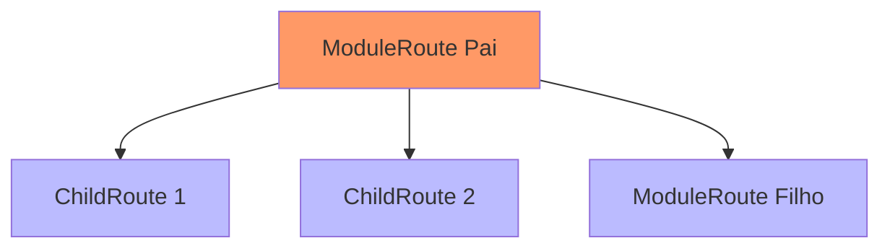

<p align="center">
  
</p>

# Modugo

**Modugo** é um sistema modular para Flutter inspirado em [Flutter Modular](https://pub.dev/packages/flutter_modular) e [Go Router Modular](https://pub.dev/packages/go_router_modular). Ele organiza sua aplicação em **módulos, rotas e injeção de dependências** de forma clara e escalável. Diferente de outros frameworks, o Modugo **não gerencia descarte automático de dependências**.

---

## 📖 Sumário

* 🚀 [Visão Geral](#-visão-geral)
* 📦 [Instalação](#-instalação)
* 🏗️ [Estrutura de Projeto](#️-estrutura-de-projeto)
* ▶️ [Primeiros Passos](#️-primeiros-passos)
* 🧭 [Navegação](#-navegação)

  * `ChildRoute`
  * `ModuleRoute`
  * `ShellModuleRoute`
  * `StatefulShellModuleRoute`
* 🔒 [Guards e propagateGuards](#-guards-e-propagateguards)
* 🛠️ [Injeção de Dependência](#️-injeção-de-dependência)
* ⏳ [AfterLayoutMixin](#-afterlayoutmixin)
* 🔎 [Regex e Matching](#-regex-e-matching)
* 📡 [Sistema de Eventos](#-sistema-de-eventos)
* 📝 [Logging e Diagnóstico](#-logging-e-diagnóstico)
* 📚 [Documentação MkDocs](#-documentação-mkdocs)
* 🤝 [Contribuições](#-contribuições)
* 📜 [Licença](#-licença)

---

## 🚀 Visão Geral

* Usa **GoRouter** para navegação.
* Usa **GetIt** para injeção de dependências.
* Dependências são registradas **uma única vez** ao iniciar.
* Não há descarte automático — dependências vivem até o app encerrar.
* Projetado para fornecer **arquitetura modular desacoplada**.

⚠️ Atenção: Diferente das versões <3.x, o Modugo **não descarta dependências automaticamente**.

---

## 📦 Instalação

```yaml
dependencies:
  modugo: ^x.x.x
```

---

## 🏗️ Estrutura de Projeto

```text
/lib
  /modules
    /home
      home_page.dart
      home_module.dart
    /profile
      profile_page.dart
      profile_module.dart
    /chat
      chat_page.dart
      chat_module.dart
  app_module.dart
  app_widget.dart
main.dart
```

---

## ▶️ Primeiros Passos

**main.dart**

```dart
Future<void> main() async {
  WidgetsFlutterBinding.ensureInitialized();

  await Modugo.configure(module: AppModule(), initialRoute: '/');

  runApp(
    ModugoLoaderWidget(
      loading: const CircularProgressIndicator(),
      builder: (_) => const AppWidget(),
    ),
  );
}
```

---

## 🧭 Navegação

### 🔹 `ChildRoute`

```dart
ChildRoute(
  path: '/home',
  child: (_, _) => const HomePage(),
)
```

### 🔹 `ModuleRoute`

```dart
ModuleRoute(
  path: '/profile',
  module: ProfileModule(),
)
```

### 🔹 `ShellModuleRoute`

Útil para criar áreas de navegação em **parte da tela**, como menus ou abas.

```dart
ShellModuleRoute(
  builder: (context, state, child) => Scaffold(body: child),
  routes: [
    ChildRoute(path: '/user', child: (_, _) => const UserPage()),
    ChildRoute(path: '/config', child: (_, _) => const ConfigPage()),
  ],
)
```

### 🔹 `StatefulShellModuleRoute`

Ideal para apps com **BottomNavigationBar** ou abas preservando estado.

```dart
StatefulShellModuleRoute(
  builder: (context, state, shell) => BottomBarWidget(shell: shell),
  routes: [
    ModuleRoute(path: '/', module: HomeModule()),
    ModuleRoute(path: '/profile', module: ProfileModule()),
  ],
)
```

---

## 🔒 Guards e propagateGuards

Você pode proteger rotas com `IGuard` ou aplicar guardas de forma recursiva usando `propagateGuards`.

```dart
List<IRoute> routes() => propagateGuards(
  guards: [AuthGuard()],
  routes: [
    ModuleRoute(path: '/', module: HomeModule()),
  ],
);
```

✅ Com isso, todos os filhos de `HomeModule` herdam automaticamente o guard.

📊 **Fluxo de execução:**



---

## 🛠️ Injeção de Dependência

```dart
final class HomeModule extends Module {
  @override
  void binds() {
    i
      ..registerSingleton<ServiceRepository>(ServiceRepository())
      ..registerLazySingleton<ApiClient>(ApiClient.new);
  }
}
```

Acesse com:

```dart
final repo = i.get<ServiceRepository>();
```

Ou via contexto:

```dart
final repo = context.read<ServiceRepository>();
```

---

## ⏳ AfterLayoutMixin

Mixin para executar código **após o primeiro layout** do widget.

```dart
class MyScreen extends StatefulWidget {
  const MyScreen({super.key});

  @override
  State<MyScreen> createState() => _MyScreenState();
}

class _MyScreenState extends State<MyScreen> with AfterLayoutMixin {
  @override
  Widget build(BuildContext context) {
    return const Scaffold(body: Center(child: Text('Hello World')));
  }

  @override
  Future<void> afterFirstLayout(BuildContext context) async {
    debugPrint('Tela pronta!');
  }
}
```

💡 Útil para:

* Carregar dados iniciais.
* Disparar animações.
* Abrir dialogs/snackbars com `BuildContext` válido.

---

## 🔎 Regex e Matching

Use `CompilerRoute` para validar e extrair parâmetros:

```dart
final route = CompilerRoute('/user/:id');

route.match('/user/42'); // true
route.extract('/user/42'); // { id: "42" }
```

---

## 📡 Sistema de Eventos

Permite comunicação desacoplada entre módulos.

```dart
final class MyEvent {
  final String message;
  MyEvent(this.message);
}

EventChannel.on<MyEvent>((event) {
  print(event.message);
});

EventChannel.emit(MyEvent('Olá Modugo!'));
```

---

## 📝 Logging e Diagnóstico

```dart
Modugo.configure(
  module: AppModule(),
  debugLogDiagnostics: true,
);
```

Exibe logs de injeção, navegação e erros.

---

## 📚 Documentação MkDocs [Em desenvolvimento]

Toda a documentação também está disponível em **MkDocs** para navegação mais amigável:
👉 [Modugo Docs](https://bed72.github.io/Modugo/)

Estrutura baseada em múltiplos tópicos (Rotas, Injeção, Guards, Eventos), permitindo leitura incremental.

---

## 🤝 Contribuições

Pull requests e sugestões são bem-vindos! 💜

---

## 📜 Licença

MIT ©
